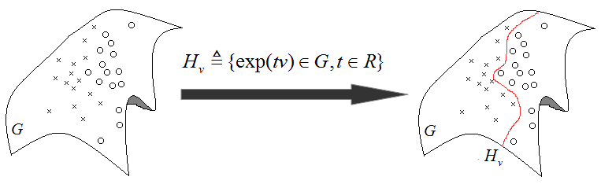
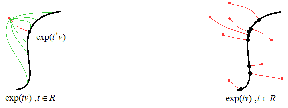
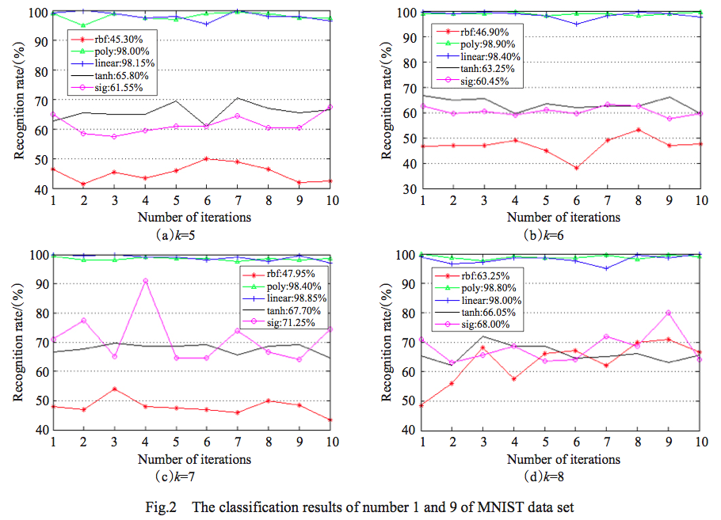
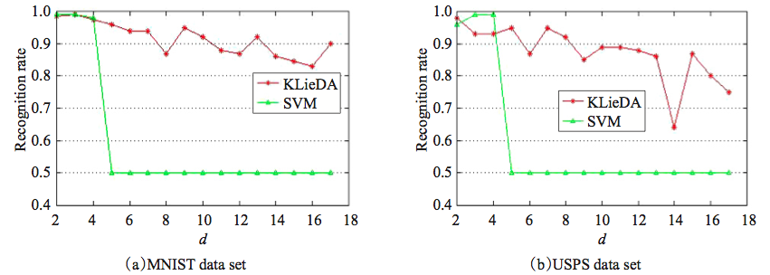

# LieFisher_KLieDA_KLieSVM
- **LieFisher** is an algorithm I designed for classification based on Lie group and LDA.
- **KLieDA** is an algorithm I designed for classification based on Lie group, kernel function, and LDA.
- **KLieSVM** is an algorithm similar to KLieDA but uses SVM instead of LDA.

## LieFisher
It was proposed in my paper [Research on Lie group means learning algorithm](http://manu46.magtech.com.cn/Jweb_prai/EN/abstract/abstract9503.shtml). In some real application and research area, the data may not distribute in Euclidean space, but in a manifold or Lie group. Therefore, most machine learning algorithms cannot handle such problems properly. LieFisher analyzes objects in manifold space and search for a geodesic via Lie algebra for classification. Another obvious advantage of LieFisher is that objects with matrix form (e.g., image is a matrix of intensities, image covariances, affinity tranformation matrice, etc) can be directly handled without converting to vector form, as such conversion usually loses 2D structure information.

The main idea of LieFisher is to find a geodesic in manifold for classification, illustration below:

The classficiation geodesic is the one that has overally minimum sum of distance of projections of all objects to it:

## KLieDA and KLieSVM
Both of them use kernel function for classification. Particularly, KLieDA is an algorithm I designed for classification based on Lie group, kernel function, and LDA. KLieSVM is an algorithm similar to KLieDA but uses SVM instead of LDA. They were proposed in my paper [Research on Lie group kernel learning algorithm](http://en.cnki.com.cn/Article_en/CJFDTotal-KXTS201211008.htm). Five kernel functions for data distributed in Lie group and manifold space were designed.

Some comparisons of different Lie group kernel functions in experiments:

And the comparison between KLieDA and KLieSVM:

## Code
The code and demo were implemented in Matlab. The repository includes two types of LieFisher, KLieDA, and KLieSVM programs and demos.
